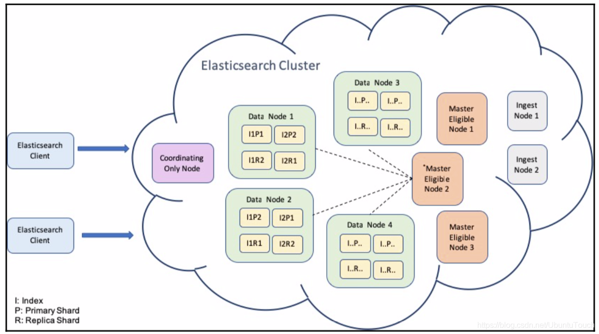
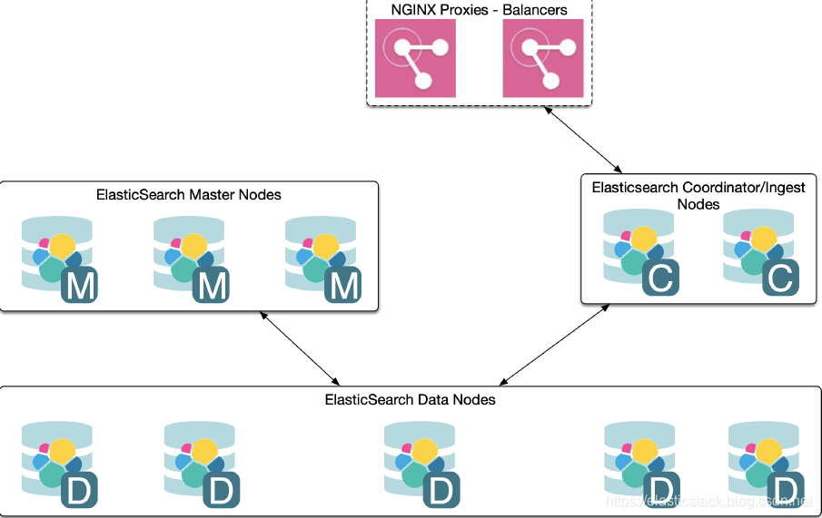
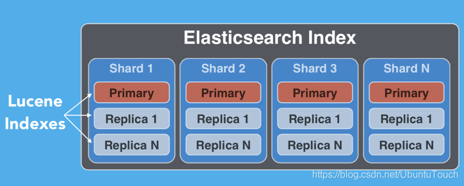
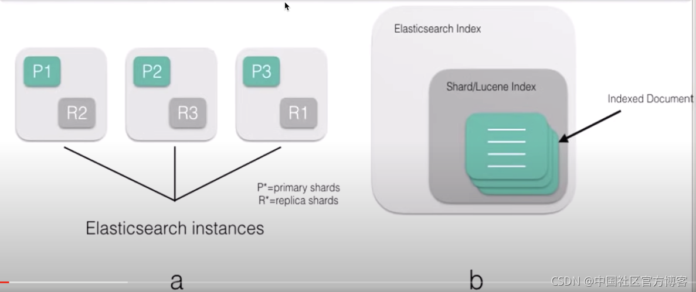
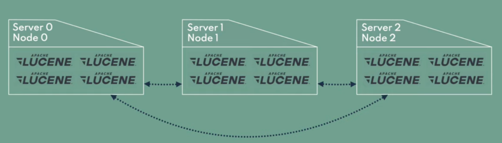
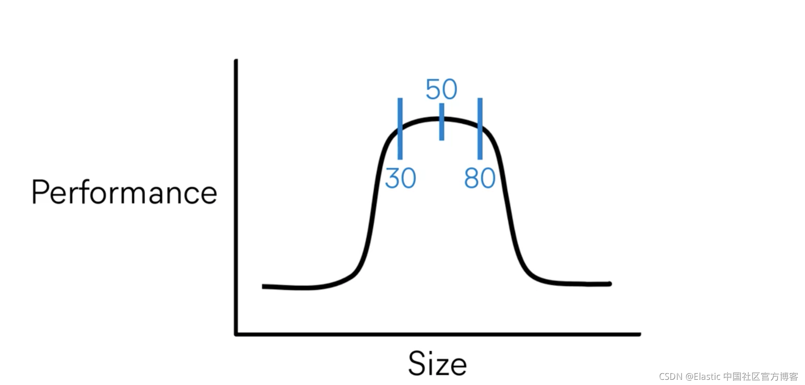
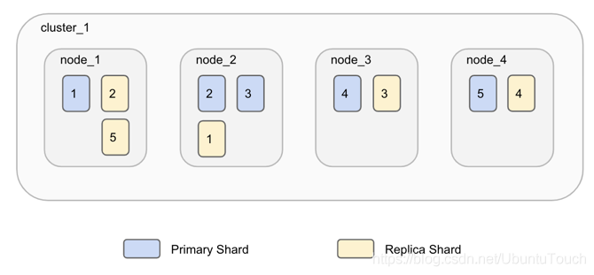
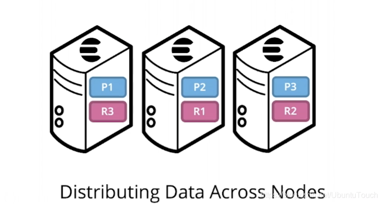
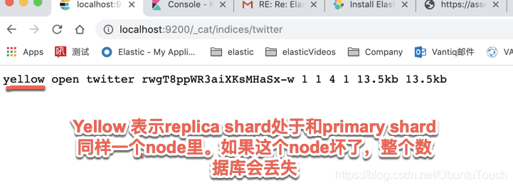
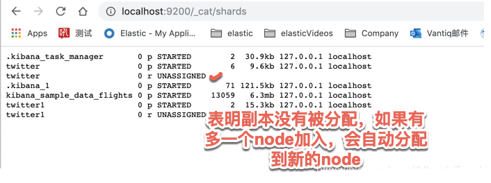

## ES 简介

[ElasticSearch](https://www.elastic.co/) 是一个基于 Lucene 的搜索服务器。它提供了一个分布式多用户能力的全文搜索引擎，基于 RESTful web 接口。Elasticsearch 是用 Java 开发的，并作为 Apache 许可条款下的开放源码发布，是当前流行的企业级搜索引擎。设计用于云计算中，能够达到实时搜索，稳定，可靠，快速，安装使用方便。

我们建立一个网站或应用程序，并要添加搜索功能，但是想要完成搜索工作的创建是非常困难的。我们希望搜索解决方案要运行速度快，我们希望能有一个零配置和一个完全免费的搜索模式，我们希望能够简单地使用 JSON 通过 HTTP 来索引数据，我们希望我们的搜索服务器始终可用，我们希望能够从一台开始并扩展到数百台，我们要实时搜索，我们要简单的多租户，我们希望建立一个云的解决方案。因此我们利用 Elasticsearch 来解决所有这些问题及可能出现的更多其它问题。

ElasticSearch 是 Elastic Stack 的核心，同时 Elasticsearch 是一个分布式、RESTful 风格的搜索和数据分析引擎，能够解决不断涌现出的各种用例。作为 Elastic Stack 的核心，它集中存储您的数据，帮助您发现意料之中以及意料之外的情况。

## ES 概念

### 集群（Cluster）

Cluster 也就是集群的意思。Elasticsearch 集群由一个或多个节点组成，可通过其集群名称进行标识。通常这个 Cluster 的名字是可以在 Elasticsearch 里的配置文件中设置的。

在默认的情况下，如果我们的 Elasticsearch 已经开始运行，那么它会自动生成一个叫做 “elasticsearch” 的集群。

我们可以在 `config/elasticsearch.yml` 里定制我们的集群的名字：

```shell
$ cat config/elasticsearch.yml
... ...
# ---------------------------------- Cluster -----------------------------------
#
# Use a descriptive name for your cluster:
#
cluster.name: aluopy-es
... ...
```

一个 Elasticsearch 的集群就像是下面的一个布局：



带有 NGINX 代理及 Balancer 的架构图是这样的：



我们可以通过

```shell
$ GET _cluster/state
```

来获取整个 cluster 的状态。这个状态只能被 master node 所改变。上面的接口返回的结果是：

```json
{
  "cluster_name" : "elastdocker-cluster",
  "cluster_uuid" : "63JoRqPDSoCJlTP9-yge2w",
  "version" : 110,
  "state_uuid" : "hv_I-Cb1QCiopx3idMj4ng",
  "master_node" : "yRTR9QE3QB2NLMShppKLZQ",
  "blocks" : { },
  "nodes" : {...},
  "metadata": {...},
  "routing_table": {...},
  "routing_nodes": {...}
} 
```

### [节点（node）](https://www.elastic.co/guide/en/elasticsearch/reference/8.2/modules-node.html#modules-node)

单个 elasticsearch 实例。 在大多数环境中，每个节点都在单独的物理机或虚拟机上运行。一个集群由一个或多个 node 组成。

在测试环境中，可以把多个 node 运行在一个 server 上。但在实际的部署中，大多数情况还是在一个 server 上运行一个 node。

集群中根据 node 的作用，可以分为不同的角色，详细内容请查看 [node roles](#Node roles)

### 文档（Document）

Elasticsearch 是面向文档的，这意味着你索引或搜索的最小数据单元是文档。

文档在 Elasticsearch 中有一些重要的属性：

- 它是独立的。文档包含字段（名称）及其值。
- 它可以是分层的。可以将其视为文档中的文档。字段的值可以很简单，就像位置字段的值可以是字符串一样。它还可以包含其他字段和值。例如，位置字段可能包含城市和街道地址。
- 结构灵活。你的文档不依赖于预定义的架构。例如，并非所有事件都需要描述值，因此可以完全省略该字段。但它可能需要新的字段，例如位置的纬度和经度。

文档通常是数据的 JSON 表示形式。JSON over HTTP 是与 Elasticsearch 进行通信的最广泛使用的方式，它是我们在本书中使用的方法。例如，你的聚会网站中的事件可以在以下文档中表示：

```json
{
  "name": "Elasticsearch Denver",
  "organizer": "Lee",
  "location": "Denver, Colorado, USA"
}
```

很多人认为 **document 相比较于关系数据库，它相应于其中每个 record**。


### ~~类型（type）~~

类型是文档的逻辑容器，类似于表是行的容器。 你将具有不同结构（模式）的文档放在不同类型中。 例如，你可以使用一种类型来定义聚合组，并在人们聚集时为事件定义另一种类型。
每种类型的字段定义称为映射。 例如，name 将映射为字符串，但 location 下的 geolocation 字段将映射为特殊的 geo_point 类型。 每种字段的处理方式都不同。 例如，你在名称字段中搜索单词，然后按位置搜索组以查找位于你居住地附近的组。

很多人认为 Elasticsearch 是 schema-less 的。大家都甚至认为 Elasticsearch 中的数据库是不需要 mapping 的。其实这是一个错误的概念。schema-less 在 Elasticsearch 中正确的理解是，我们不需要事先定义一个类型关系数据库中的 table 才使用数据库。在 Elasticsearch 中，我们可以不开始定义一个 mapping，而直接写入到我们指定的 index 中。这个 index 的 mapping 是动态生成的 （当然我们也可以[禁止](https://www.elastic.co/guide/en/elasticsearch/reference/current/docs-index_.html)这种行为）。其中的数据项的每一个数据类型是动态识别的。比如时间，字符串等，虽然有些的数据类型还是需要我们手动调整，比如 geo_point 等地理位置数据。另外，它还有一个含义，同一个 type，我们在以后的数据输入中，可能增加新的数据项，从而生产新的 mapping。这个也是动态调整的。

Elasticsearch 具有 schema-less 的能力，这意味着无需显式指定如何处理文档中可能出现的每个不同字段即可对文档建立索引。 启用动态映射后，Elasticsearch 自动检测并向索引添加新字段。 这种默认行为使索引和浏览数据变得容易-只需开始建立索引文档，Elasticsearch 就会检测布尔值，浮点数和整数值，日期和字符串并将其映射到适当的 Elasticsearch 数据类型。

由于一些[原因](https://www.elastic.co/guide/en/elasticsearch/reference/6.7/removal-of-types.html)，在 Elasticsearch 6.0 以后，一个 Index 只能含有一个 type。这其中的原因是：相同 index 的不同映射 type 中具有相同名称的字段是相同； 在 Elasticsearch 索引中，不同映射 type 中具有相同名称的字段在 Lucene 中被同一个字段支持。在默认的情况下是 **_doc**。在8.0的版本中，type 将被彻底删除。

### 索引（index）

在 Elasticsearch 中，索引是文档的集合。





Elasticsearch 起源于 [Apache Lucene](https://lucene.apache.org/) 。一个 Elasticsearch 的 index 分布于一个或多个 shard 之中，而每个 shard 相应于一个 Apache Lucene 的 index。每个 Index 由一个或许多的 documents 组成，并且这些 document 可以分布于不同的 shard 之中。



很多人认为 index 类似于关系数据库中的 database。这种说法是有些道理，但是并不完全相同。其中很重要的一个原因是，在Elasticsearch 中的文档可以有 object 及 nested（嵌套） 结构。一个 index 是一个逻辑命名空间，它映射到一个或多个主分片，并且可以具有零个或多个副本分片。

每当一个文档进来后，根据文档的 id 会自动进行 hash 计算，并存放于计算出来的 shard 实例中，这样的结果可以使得所有的 shard 都比较有均衡的存储，而不至于有的 shard 很忙。

```
shard_num = hash(_routing) % num_primary_shards
```

在默认的情况下，上面的 _routing 既是文档的 _id。如果有 routing 的参与，那么这些文档可能只存放于一个特定的 shard，这样的好处是对于一些情况，我们可以很快地综合我们所需要的结果而不需要跨 node 去得到请求。比如针对 join 的数据类型。

从上面的公式我们也可以看出来，我们的 **shard 数目是不可以动态修改的**，否则之后也找不到相应的 shard 号码了。必须指出的是，**replica 的数目是可以动态修改的**。

### 分片（shard）

由于 Elasticsearch 是一个分布式搜索引擎，因此索引通常会拆分为分布在多个节点上的称为分片的元素。 Elasticsearch 自动管理这些分片的排列。 它还根据需要重新平衡分片，因此用户无需担心细节。

一个索引可以存储超出单个结点硬件限制的大量数据。比如，一个具有10亿文档的索引占据1TB的磁盘空间，而任一节点都没有这样大的磁盘空间；或者单个节点处理搜索请求，响应太慢。为了解决这个问题，Elasticsearch 提供了将索引划分成多份的能力，这些份就叫做分片（shard）。当你创建一个索引的时候，你可以指定你想要的分片(shard)的数量。每个分片本身也是一个功能完善并且独立的“索引”，这个“索引”可以被放置到集群中的任何节点上。 

分片之所以重要，主要有两方面的原因：

- 允许你水平分割/扩展你的内容容量
- 允许你在分片（潜在地，位于多个节点上）之上进行分布式的、并行的操作，进而提高性能/吞吐量

有两种类型的分片：primary shard 和 replica shard

- **Primary shard**：每个文档都存储在一个Primary shard。 索引文档时，它首先在 Primary shard上编制索引，然后在此分片的所有副本上（replica）编制索引。索引可以包含一个或多个主分片。 此数字确定索引相对于索引数据大小的可伸缩性。 创建索引后，无法更改索引中的主分片数。Primary 可以同时出来读和写操作。一个索引可以由多个主分片组成，每个分片都具有索引（或写入）文档的能力。 当 Elasticsearch 试图在集群中均匀分布分片时，每个主分片都可以利用节点资源来实现写入可扩展性。。当一个文档被索引到 Elasticsearch 中时，它会在被复制到副本分片之前由主分片索引。 只有在成功更新副本分片后才会确认索引请求，从而确保跨 Elasticsearch 集群的读取一致性。
- **Replica shard**：每个主分片可以具有零个或多个副本。 replica 是主分片的副本。replica 只能是只读的，不可以进行写入操作。replica 分片可以独立于主分片响应搜索（或读取）请求。 由于主分片和副本分片被分配到不同的节点（为索引提供更多计算资源），因此可以通过添加 replica 来实现读取可扩展性。如果一个索引的 primary shard 一旦被丢失（有宕机或者网络连接问题），那么相应的 replica shard 会被自动提升为新的 primary shard，进而新的 replica 也会在不同的 node 上生成。replica 有两个目的：*增加故障转移*：如果主要故障，可以将副本分片提升为主分片。即使你失去了一个 node，那么副本分片还是拥有所有的数据；*提高性能*：get 和 search 请求可以由主 shard 或副本 shard 处理。

我们需要记住的一点是：Primary 及 replica shards 一直是分配在不同的 node 上的，这样既提供了冗余度，也同时提供了可扩展行。

默认情况下，每个主分片都有一个副本，但可以在现有索引上动态更改副本数。我们可以通过如下的方法来动态修改副本数：

```
PUT my_index/_settings
{
    "number_of_replicas": 2
}
```

永远不会在与其主分片相同的节点上启动副本分片。在最新的 Elasticsearch 集群设计中，我们可以使用 [auto_expand_replica](https://www.elastic.co/guide/en/elasticsearch/reference/current/index-modules.html#dynamic-index-settings) 这个配置来让 Elasticsearch 自动决定有多少个 replica。当我们有一个节点时，通过这个设置，我们可能会得到 0 个 replica 从而保证整个集群的健康状态。

通常一个 shard 可以存储许多文档。在实际的使用中，增加副本 shard 的数量，可以提高搜索的速度，这是因为更多的 shard 可以帮我们同时进行搜索。但是副本 shard 数量的增多，也会影响数据写入的速度。在很多的情况下，在大批量数据写入的时候，我们甚至可以把 replica 的数量设置为 0。详细阅读可以参考文章 “[Elasticsearch：如何提高 Elasticsearch 数据摄入速度](https://elasticstack.blog.csdn.net/article/details/119750007)”。增加 primary shard 的数量可以提高数据的写入速度，这是因为有更多的 shard 可以帮我们同时写入数据。可能有很多的开发者认为是不是 shard 的数量越多越好啊？[oversharding](https://www.elastic.co/guide/en/elasticsearch/reference/8.2/avoid-oversharding.html) 是 Elasticsearch 用户经常会遇到的一个问题。许多小的 shard 会消耗很多的资源，这是因为每一个 shard 其实对应的是一个 Lucene 的 index。一个 shard 通常可以存储几十个 G 的数据。如果你需要更多的 shard，你可以：

- 创建更多的索引从而使得它容易扩展，比如针对一些时序数据，我们可以为它们每天或者每个星期创建新的索引
- 使用 Split API 来使一个大的索引增加 shard 的数量。我们可以阅读文章 “[Elasticsearch：Split index API - 把一个大的索引分拆成更多分片](https://elasticstack.blog.csdn.net/article/details/108960950)”。

一个 shard 的性能会随着它的大小而改变：



如上图所示，我们建议 50G 为索引的大小以求得最好的性能。在我们实际的 Beats 的使用中，默认的 ILM 索引大小就是 50G。为了最大限度地提高索引/搜索性能，分片应尽可能均匀分布在节点之间，以利用底层节点资源。 每个分片应保存 30 GB 到 50 GB 的数据，具体取决于数据类型及其使用方式。 例如，高性能搜索用例可以受益于整体较小的分片以运行快速搜索和聚合请求，而日志记录用例可能适合稍大的分片以在集群中存储更多数据。 可以根据你的性能要求、硬件和用例根据需要调整分片大小和每个节点的分片数量。

下面的图表示的是一个 index 有5个 shard 及1个 replica



这些 shard 分布于不同的物理机器上：



我们可以为每个 index 设置相应的 shard 数值：

```shell
curl -XPUT http://localhost:9200/another_user?pretty -H 'Content-Type: application/json' -d '
{
    "settings" : {
        "index.number_of_shards" : 2,
        "index.number_of_replicas" : 1
    }
}'
```

比如在上面的 REST 接口中，我们为 another_user 这个 index 设置了2个 shards，并且有一个 replica。一旦设置好 primary shard 的数量，我们就不可以修改了。这是因为 Elasticsearch 会依据每个 document 的 id 及 primary shard 的数量来把相应的 document 分配到相应的 shard 中。如果这个数量以后修改的话，那么每次搜索的时候，可能会找不到相应的 shard。

我们可以通过如下的接口来查看我们的 index 中的设置：

```shell
curl -XGET http://localhost:9200/twitter/_settings?pretty 
```

上面我们可以得到 twitter index 的设置信息：

```json
{
  "twitter" : {
    "settings" : {
      "index" : {
        "creation_date" : "1565618906830",
        "number_of_shards" : "1",
        "number_of_replicas" : "1",
        "uuid" : "rwgT8ppWR3aiXKsMHaSx-w",
        "version" : {
          "created" : "7030099"
        },
        "provided_name" : "twitter"
      }
    }
  }
}
```

### 副本（replica）

默认情况下，Elasticsearch 为每个索引创建一个主分片和一个副本。这意味着每个索引将包含一个主分片，每个分片将具有一个副本。

分配多个分片和副本是分布式搜索功能设计的本质，提供高可用性和快速访问索引中的文档。主副本和副本分片之间的主要区别在于只有主分片可以接受索引请求。副本和主分片都可以提供查询请求。

在上图中，我们有一个 Elasticsearch 集群，由默认分片配置中的两个节点组成。 Elasticsearch 自动排列分割在两个节点上的一个主分片。有一个副本分片对应于每个主分片，但这些副本分片的排列与主分片的排列完全不同。

请允许我们澄清一下：请记住，number_of_shards 值与索引有关，而不是与整个群集有关。此值指定每个索引的分片数（不是群集中的主分片总数）。

我们可以通过如下的接口来获得一个 index 的健康情况：

```
http://localhost:9200/_cat/indices/twitter
```

上面的接口可以返回如下的信息：



更进一步的查询，我们可以看出：



如果一个 index 显示的是红色，表面这个 index 至少有一个 primary shard 没有被正确分配，并且有的 shard 及其相应的 replica 已经不能正常访问。 如果是绿色，表明 index 的每一个 shard 都有备份 （replica），并且其备份也成功复制在相应的 replica shard 之中。如果其中的一个 node 坏了，相应的另外一个 node 的 replica 将起作用，从而不会造成数据的丢失。

我们可以通过如下的命令来查看集群的健康状态：

```console
GET _cluster/health
{
  "cluster_name" : "elastdocker-cluster",
  "status" : "green",
  "timed_out" : false,
  "number_of_nodes" : 1,
  "number_of_data_nodes" : 1,
  "active_primary_shards" : 10,
  "active_shards" : 10,
  "relocating_shards" : 0,
  "initializing_shards" : 0,
  "unassigned_shards" : 0,
  "delayed_unassigned_shards" : 0,
  "number_of_pending_tasks" : 0,
  "number_of_in_flight_fetch" : 0,
  "task_max_waiting_in_queue_millis" : 0,
  "active_shards_percent_as_number" : 100.0
}
```

Shard 健康

- <font color="#FF0000">**红色**</font>：集群中未分配至少一个主分片
- <font color="FFFF00">**黄色**</font>：已分配所有主副本，但未分配至少一个副本
- <font color="#008000">**绿色**</font>：分配所有分片

