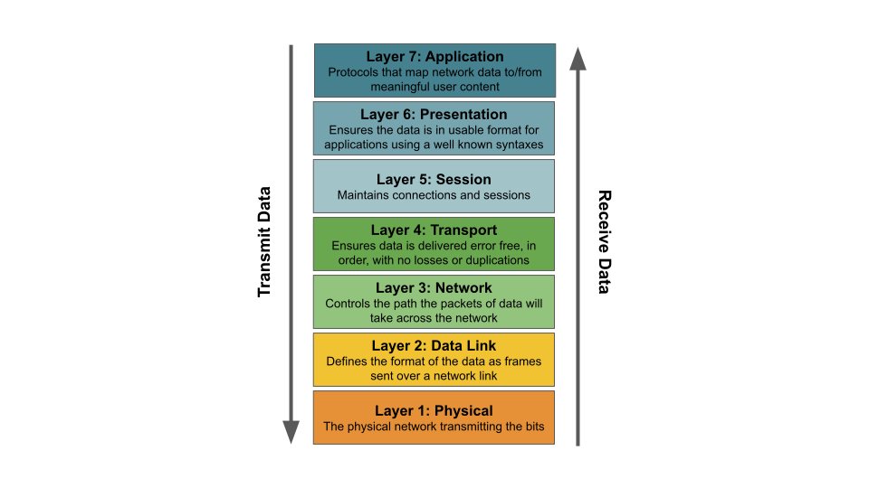

本指南简要介绍了一些关键的基本网络概念，供任何不熟悉它们的人使用。

在本指南中，您将学习：

- 用于描述网络不同层的术语
- 网络数据包的剖析
- MTU 是什么以及为什么它会有所作为
- IP 寻址、子网和 IP 路由的工作原理
- 什么是覆盖网络
- 什么是 DNS 和 NAT

## Network layers（网络层）

通过网络发送和接收数据的过程通常分为 7 层（称为 OSI 模型）。这些层通常缩写为 L1 - L7。您可以将数据视为从应用程序发送或接收数据时依次通过这些层中的每一个，每个层负责通过网络发送或接收数据所需的特定处理部分。

在现代企业或公共云网络中，层通常映射如下：

- L5-7：大多数应用程序开发人员熟悉的所有协议。例如 HTTP、FTP、SSH、SSL、DNS
- L4：TCP 或 UDP，包括源端口和目标端口
- L3：IP 数据包和 IP 路由
- L2：以太网数据包和以太网交换

## 网络数据包剖析

通过网络发送数据时，网络堆栈中的每一层都添加自己的标头，其中包含该层需要的控制/元数据，以便在数据包穿过网络时对其进行处理，并将生成的数据包传递到堆栈的下一层。这样就产生了完整的数据包，其中包括堆栈的每一层所需的所有控制/元数据，而无需任何层理解数据或需要处理相邻网络层的控制/元数据。

## IP 寻址、子网和 IP 路由

L3 网络层引入了 IP 地址，通常标志着应用程序开发人员关心的网络部分和网络工程师关心的网络部分之间的边界。特别是应用程序开发人员通常将 IP 地址视为网络流量的源和目的地，但对了解 L3 路由或网络堆栈中任何较低级别的东西的需求要少得多，这更多是网络工程师的领域。

IP 地址有两种变体：IPv4 和 IPv6。

- IPv4 地址长度为 32 位，是最常用的。它们通常表示为 4 个十进制字节（每个 0-255），由点分隔。例如`192.168.27.64`。有几个 IP 地址范围保留为“私有”，只能在本地私有网络中使用，不能通过 Internet 路由。企业可以根据需要随时重复使用这些内容。相比之下，“公共”IP 地址在整个互联网上是全球唯一的。随着连接到 Internet 的网络设备和网络数量的增长，公共 IPv4 地址现在供不应求。
- IPv6 地址长度为 128 位，旨在克服 IPv4 地址空间不足的问题。它们通常由 8 组 4 位十六进制数表示。例如`1203:8fe0:fe80:b897:8990:8a7c:99bf:323d`。由于 128 位长度，不乏 IPv6 地址。然而，许多企业在采用 IPv6 方面进展缓慢，因此至少目前，IPv4 仍然是许多企业和数据中心网络的默认设置。

IP 地址组通常使用 [CIDR](https://en.wikipedia.org/wiki/Classless_Inter-Domain_Routing) 表示法表示，该表示法由 IP 地址和由 `/` 分隔的 IP 地址上的有效位数组成。例如，`192.168.27.0/24` 表示从 `192.168.27.0` 到 `192.168.27.255` 的 256 个 IP 地址组。

单个 L2 网络中的一组 IP 地址称为子网。在子网内，数据包可以在任何一对设备之间作为单个网络跃点发送，仅基于 L2 标头（和页脚）。

将数据包发送到单个子网之外需要 L3 路由，每个 L3 网络设备（路由器）负责根据 L3 路由规则决定发送数据包的路径。充当路由器的每个网络设备都有路由，这些路由确定特定 CIDR 的数据包接下来应该发送到哪里。例如，在 Linux 系统中，`10.48.0.128/26 via 10.0.0.12 dev eth0` 路由表示目标 IP 地址为 `10.48.0.128/26` 的数据包应通过 `eth0` 接口路由到 `10.0.0.12` 的下一个网络跃点。

路由可以由管理员静态配置，或使用路由协议动态编程。在使用路由协议时，通常需要对每个网络设备进行配置，以告知它应该与哪些其他网络设备交换路由。然后，当添加或删除设备，或者网络链接进入或停止服务时，路由协议会处理整个网络中正确路由的编程。

大型企业和数据中心网络中使用的一种常见路由协议是 [BGP](https://en.wikipedia.org/wiki/Border_Gateway_Protocol)。 BGP 是支持互联网的主要协议之一，因此可扩展性非常好，并且得到现代路由器的广泛支持。

## Overlay networks（覆盖网络）

覆盖网络允许网络设备通过底层网络（称为底层网络）进行通信，而底层网络不知道连接到覆盖网络的设备。从连接到覆盖网络的设备的角度来看，它看起来就像一个普通的网络。有许多不同类型的覆盖网络使用不同的协议来实现这一点，但总的来说，它们具有相同的共同特征，即获取网络数据包（称为内部数据包）并将其封装在外部网络数据包中。通过这种方式，底层可以看到外部数据包，而无需了解如何处理内部数据包。

覆盖层如何知道将数据包发送到哪里取决于覆盖层类型和它们使用的协议。同样，数据包的包装方式在不同的覆盖类型之间也有所不同。例如，在 VXLAN 的情况下，内部数据包被包装并在外部数据包中作为 UDP 发送。

覆盖网络的优点是对底层网络基础设施的依赖性最小，但也有以下缺点：

- 与非覆盖网络相比，对性能的影响较小，如果运行网络密集型工作负载，您可能希望避免这种影响
- 覆盖上的工作负载不容易从网络的其余部分寻址。因此，需要 NAT 网关或负载平衡器在覆盖网络和底层网络之间桥接，以实现对覆盖网络的任何入口或出口。

## DNS

虽然通过网络的底层网络数据包流是使用 IP 地址确定的，但用户和应用程序通常希望使用众所周知的名称来识别随时间保持一致的网络目的地，即使底层 IP 地址发生变化。例如，将 `google.com` 映射到 `216.58.210.46`。这种从名称到 IP 地址的转换由 [DNS](https://en.wikipedia.org/wiki/Domain_Name_System) 处理。 DNS 在目前描述的基础网络之上运行。连接到网络的每个设备通常都配置有一个或多个 DNS 服务器的 IP 地址。当应用程序想要连接到域名时，会向 DNS 服务器发送一条 DNS 消息，然后 DNS 服务器会响应有关该域名映射到哪个 IP 地址的信息。然后，应用程序可以启动与所选 IP 地址的连接。

## NAT

网络地址转换 ([NAT](https://en.wikipedia.org/wiki/Network_address_translation)) 是当数据包通过执行 NAT 的设备时，将数据包中的 IP 地址映射到不同 IP 地址的过程。根据使用情况，NAT 可以应用于源 IP 地址或目标 IP 地址，或同时应用于这两个地址。

NAT 的一种常见用例是允许具有私有 IP 地址的设备通过 Internet 与具有公共 IP 地址的设备通信。例如，如果具有私有 IP 地址的设备尝试连接到公共 IP 地址，则位于私有网络边界的路由器通常会使用 SNAT（源网络地址转换）来映射数据包的私有源 IP 地址到路由器自己的公共 IP 地址，然后再将其转发到 Internet。然后，路由器将来自相反方向的响应数据包映射回原始私有 IP 地址，因此数据包在两个方向上端到端流动，而源或目的地都不知道映射正在发生。相同的技术通常用于允许连接到覆盖网络的设备与覆盖网络外部的设备连接。

NAT 的另一个常见用例是负载平衡。在这种情况下，负载平衡器执行 DNAT（目标网络地址转换）以将传入连接的目标 IP 地址更改为要进行负载平衡的所选设备的 IP 地址。然后，负载均衡器在响应数据包上反转此 NAT，因此源设备或目标设备都不知道映射正在发生。

## MTU

网络链接的最大传输单元 ([MTU](https://en.wikipedia.org/wiki/Maximum_transmission_unit)) 是可以通过该网络链接发送的数据包的最大大小。网络中的所有链路通常都配置相同的 MTU，以减少在数据包穿越网络时对数据包进行分段的需要，这会显着降低网络性能。此外，TCP 尝试学习路径 MTU，并根据网络路径中任何链路的最小 MTU 调整每个网络路径的数据包大小。当应用程序尝试发送的数据超出单个数据包的容量时，TCP 会将数据分成多个 TCP 段，因此不会超过 MTU。

大多数网络都有 MTU 为 1,500 字节的链接，但有些网络支持 9,000 字节的 MTU。在 Linux 系统中，较大的 MTU 大小会导致 Linux 网络堆栈在发送大量数据时使用较低的 CPU，因为它必须为相同数量的数据处理更少的数据包。根据所使用的网络接口硬件，其中一些开销可能会转移到网络接口硬件上，因此 MTU 大小的大小对设备的影响因设备而异。